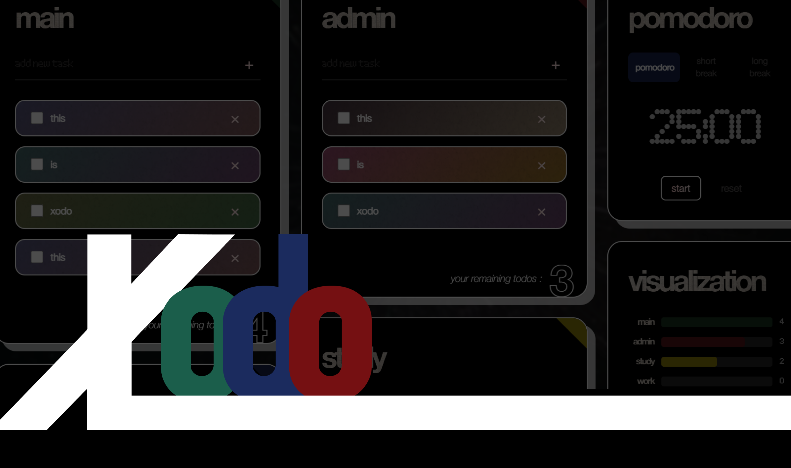
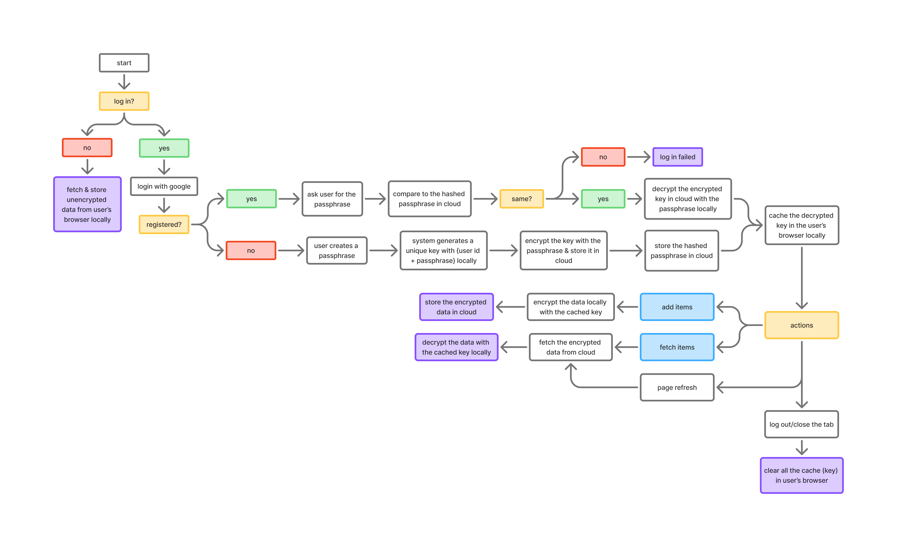

# Xodo: A Privacy & Keyboard-first Todo App

An End-to-End Encrypted (E2EE), keyboard-centric productivity web app with Unix-like commands

## Features
> the demo GIFs take *quite* a while to load *(~30s)*, you can check out other sections first or directly try it yourself on [xodo.ktiong.com](https://xodo.ktiong.com) ;\)

### 1. Keyboard-Centric
- Use Xodo with familiar Unix-style commands if you're a developer or keyboard enthusiast.

> *See the full [list of commands](https://www.ktiong.com/blog/xodo-doc) supported.*

### 2. Privacy-Preserving
- Only your Google account name and email address are ever known to us. All your todo data is encrypted locally before being securely synced to the cloud — ensuring only YOU can read your tasks.

### 3. Ultra Responsive
- Enjoy a fast, fluid UI experience with the Masonry library on ANY devices.

<!-- ## Workflow
 -->

## Tech Stack
### Frontend
- Next.js, Tailwind CSS, shadcn/ui, Masonry, IndexedDB
### Backend
- Firebase 
  - Auth: Google OAuth2 
  - Binary Storage: Firestore
### Cryptographic Algorithm
- Web Crypto API
  - Hashing: PBKDF2 with SHA-256
  - Crypto: AES-GCM
### Deployment
- Vercel

## Technical Details
Data Flow (logged-in users)

Auth → user logs in → app prompts for passphrase → derives/decrypts AES key (cached in memory).
Fetch → Firestore data is decrypted into memory (Zustand todoLists). UI renders from Zustand only.
Edit → user types/adds/deletes → Zustand updates immediately (UI stays in sync).
Sync → a 500ms debounce walks current todoLists, encrypts todos with the cached key, and writes to Firestore. This is write-only; no Firestore listener runs.
Logout → clears Zustand and key cache; IndexedDB is not used for logged-in users.
Data Flow (anonymous users)

Uses local template lists stored in IndexedDB (todos1…todos6).
No Firestore access; everything stays in IndexedDB.
Logout/reset just clears those IndexedDB keys.