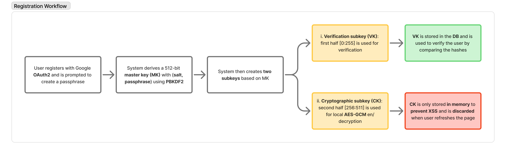

# Xodo: Privacy & Keyboard-first Todo App
An End-to-End Encrypted (E2EE), keyboard-centric productivity web app with Unix-like commands

> try out here: [https://xodo.ktiong.com](https://xodo.ktiong.com)

## 1. Why it's secure?
Below is the high-level overview of the registration workflow. For visitors, data is unencrypted and is stored in users' browser IndexedDB.

In other words, only your Google account name and email address are ever known to us. All your todo data is encrypted locally before being securely synced to the cloud, ensuring only YOU can read your tasks.

## 2. Unix-like commands = Low learning curve = More productivity
You can use your favorite Unix commands to boost your productivity in Xodo. If you already know them, there's basically no learning curve.

> *See the full [list of commands](https://www.ktiong.com/blog/xodo-doc) supported.*

## 3. Tech Stack
### Frontend
- **Next.js**, **Tailwind CSS**, GSAP, Masonry
### Backend
- **Firebase** (OAuth2 & Firestore)
### Cryptography
- Web Crypto API (**PBKDF2** for hashing, **AES-GCM** for en/decryption)